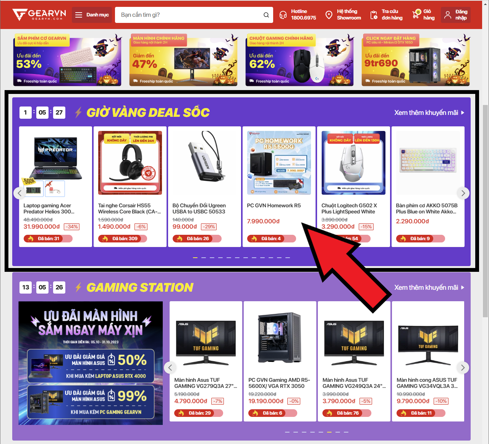
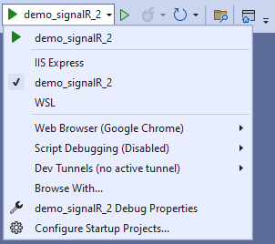

<p align="center">
    <a href="https://dotnet.microsoft.com/en-us/apps/aspnet/signalr">
        
    </a>
</p>

# Demo SignalR 2

*Ví dụ này mình lấy ý tưởng thực tế từ trang Gearvn.com*  


Khi một món hàng trong bảng “GIỜ VÀNG DEAL SỐC” được mua, các khách hàng đang ở trang chủ sẽ nhận được thông báo và thanh số lượng đã bán sẽ được tăng lên tương ứng.

## Các công cụ sử dụng 

- [Visual Studio 2022][0]
- [SQL Server 2022][1]
- SQL Server Management Studio 2019

## Hướng dẫn

### Bước 1

Cài đặt **ASP.NET and web development**  


### Bước 2

Tải và giải nén solution template mình đã chuẩn bị sẵn cho giao diện  
[template_demo_signalR_1.zip](for_demo/template_demo_signalR_2.zip).

Nhấp đúp chuột vào file *demo_signalR_2.sln* để mở solution.  


Thay đổi Startup project từ **IIS Express** thành **demo_signalR_2** để trong lúc chạy sẽ hiện ra một cửa sổ console (phục vụ việc theo dõi).  


Nhấn **Ctrl + F5** hoặc nút **play** bên cạnh để chạy web.  


Cửa sổ console:  


### Bước 3: Cài đặt Package

Trong Solution Explorer, mở *Nuget Package Manager* theo cách sau:  


Tìm và cài đặt các gói sau:  


### Bước 4: SignalR Hub

**Tạo Hubs/SaleHub**
```
public class SaleHub: Hub
{
    public override Task OnConnectedAsync()
    {
        Console.WriteLine($"{Context.ConnectionId} has joined to Hub");
        return base.OnConnectedAsync();
    }

    public override Task OnDisconnectedAsync(Exception? exception)
    {
        Console.WriteLine($"{Context.ConnectionId} has left the Hub");
        return base.OnDisconnectedAsync(exception);
    }

}
```

**Kết nối những Client đang ở Index page vào Hub**

Trong Pages/Index.razor,  
Khai báo thư viện SignalR.Client và một DI trong Asp.net là NavigationManager.
```
@using Microsoft.AspNetCore.SignalR.Client;
@inject NavigationManager Navigation;
```

Trong ```@code{ ... }``` khai báo:
```
private HubConnection? hubConnection;
```

Tiếp theo, kết nối Client vào Hub bằng cách sau,  
Trong phương thức OnInitializedAsync(), thêm:
```
hubConnection = new HubConnectionBuilder()
    .WithUrl(Navigation.ToAbsoluteUri("/saleHub"))
    .Build();

await hubConnection.StartAsync();
```
Nếu bạn gặp khó khăn, xem full code tại [Index.razor](demo_signalR_2/Pages/Index.razor).

Cuối cùng,  
Thêm thư viện SignalR và ánh xạ DashboardHub thành đường dẫn url trong Program.cs.
```
builder.Services.AddSignalR();
app.MapHub<SaleHub>("/saleHub");
```

Chạy ứng dụng và mở cửa sổ console, ta được kết quả như sau:  


### Bước 5: Realtime với SignalR

Tạo Service có chức năng thông báo tới các client đang ở trang Index rằng có ai đó đã mua sản phẩm trong bảng Sale

Tạo Services/SaleService.cs:
```
public class SaleService
{
    private readonly IHubContext<SaleHub> _context;
    public SaleService(IHubContext<SaleHub> context)
    {
        _context = context;
    }
    public void NotifyHub(string customerName, string productName, int quantity)
    {
        _context.Clients.All.SendAsync("RefreshSaleProducts", customerName, productName, quantity);
    }
}
```

Trong GoShopping.razor, thêm:
```
@using demo_signalR_2.Services
@inject SaleService SaleService;
```

Tìm đến khối lệnh ```if (!result.Canceled)```,  
Thêm vào cuối dòng code sau:
```
SaleService.NotifyHub(customerName, productName, quantityInt);
```

Để những client nào nhận tin nhắn từ Hub, sẽ hiện thông báo lên màn hình và cập nhật giao diện tương ứng, ta làm như sau:  
Trong Index.razor,  
Khai báo Snackbar, một thể hiện của ISnackbar để hiện thông báo:
```
@inject ISnackbar Snackbar
```

Sau dòng lệnh khởi tạo hubConnection,  
Thêm logic xử lý như client nhận được thông báo từ Hub.
```
hubConnection.On<string, string, int>("RefreshSaleProducts", (customerName, productName, quantity) =>
{
    InvokeAsync(() =>
    {
        StateHasChanged();
        Snackbar.Add(
            $"{customerName} đã mua {quantity} {productName}", Severity.Success
        );
    });

});
```

Cuối cùng, đăng ký SaleService trong file Program.cs:
```
builder.Services.AddSingleton<SaleService>();
```

Chạy ứng dụng và thử nghiệm.

### Bước 6: DisposeHubConnection

Ngắt kết nối với hub khi client rời khỏi trang Index.

Trong Pages/Index.razor,  
Triển khai interface IDisposable:
```
@implements IDisposable
```
```
public void Dispose()
{
    DisposeHubConnection();
}

private void DisposeHubConnection()
{
    if (hubConnection != null)
    {
        hubConnection.DisposeAsync();
        hubConnection = null;
    }
}
```

[0]: https://visualstudio.microsoft.com/
[1]: https://www.microsoft.com/en-us/sql-server